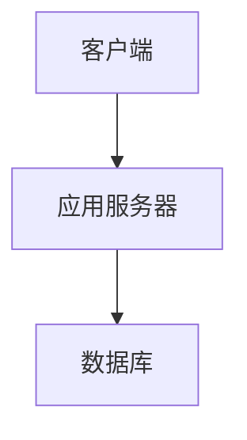
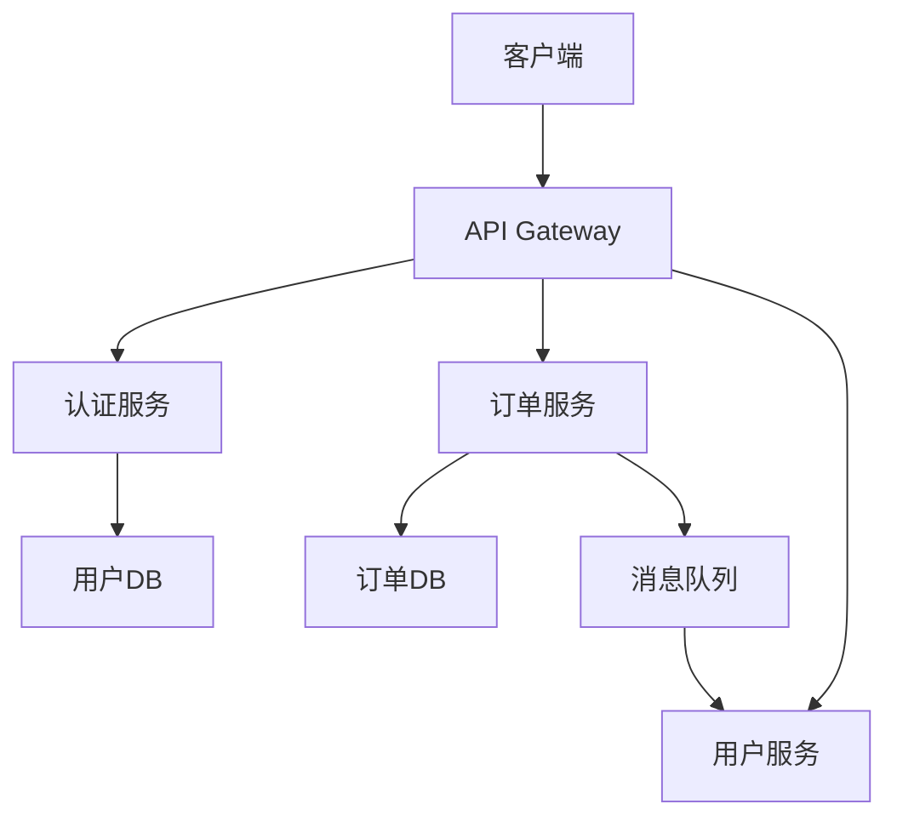
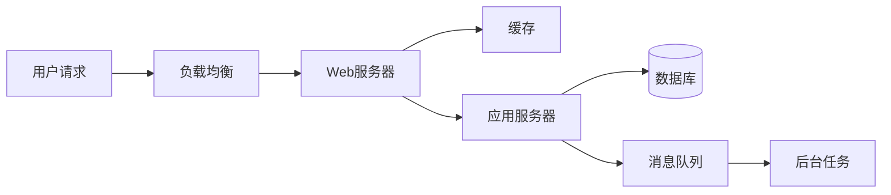
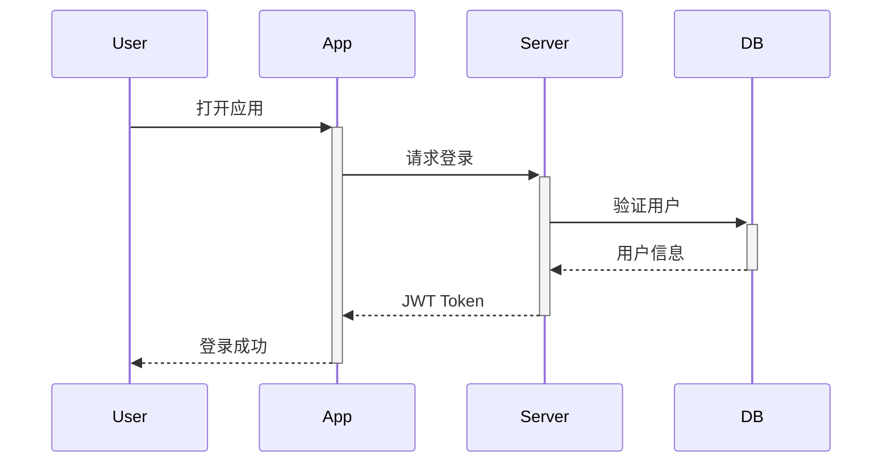
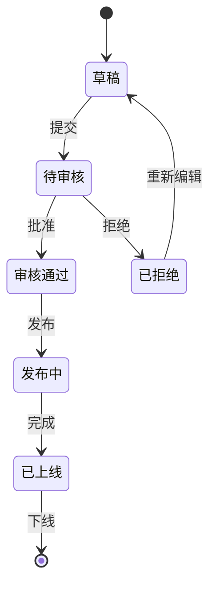
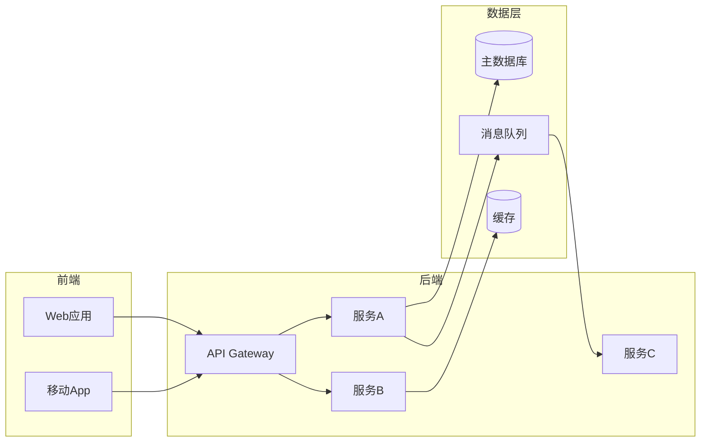

# Mermaid 图表示例 | Diagram Examples

## 架构图

### 单体架构

```mermaid
graph TD
    Client["客户端"]
    Server["应用服务器"]
    DB["数据库"]

    Client --> Server
    Server --> DB
```

### 微服务架构

```mermaid
graph TD
    Client["客户端"]
    Gateway["API Gateway"]
    Auth["认证服务"]
    Order["订单服务"]
    User["用户服务"]
    DB1["用户DB"]
    DB2["订单DB"]
    MQ["消息队列"]

    Client --> Gateway
    Gateway --> Auth
    Gateway --> Order
    Gateway --> User
    Auth --> DB1
    Order --> DB2
    Order --> MQ
    MQ --> User
```

## 数据流图

```mermaid
flowchart LR
    A[用户请求] --> B[负载均衡]
    B --> C[Web服务器]
    C --> D[缓存]
    C --> E[应用服务器]
    E --> F[(数据库)]
    E --> G[消息队列]
    G --> H[后台任务]
```

## 序列图

```mermaid
sequenceDiagram
    User->>+App: 打开应用
    App->>+Server: 请求登录
    Server->>+DB: 验证用户
    DB-->>-Server: 用户信息
    Server-->>-App: JWT Token
    App-->>-User: 登录成功
```

## 状态图

```mermaid
stateDiagram-v2
    [*] --> 草稿
    草稿 --> 待审核: 提交
    待审核 --> 审核通过: 批准
    待审核 --> 已拒绝: 拒绝
    审核通过 --> 发布中: 发布
    发布中 --> 已上线: 完成
    已上线 --> [*]: 下线
    已拒绝 --> 草稿: 重新编辑
```

## 组件图

```mermaid
graph LR
    subgraph 前端
        Web[Web应用]
        Mobile[移动App]
    end

    subgraph 后端
        API[API Gateway]
        S1[服务A]
        S2[服务B]
        S3[服务C]
    end

    subgraph 数据层
        DB[(主数据库)]
        Cache[(缓存)]
        MQ[消息队列]
    end

    Web --> API
    Mobile --> API
    API --> S1
    API --> S2
    S1 --> DB
    S2 --> Cache
    S1 --> MQ
    MQ --> S3
```
