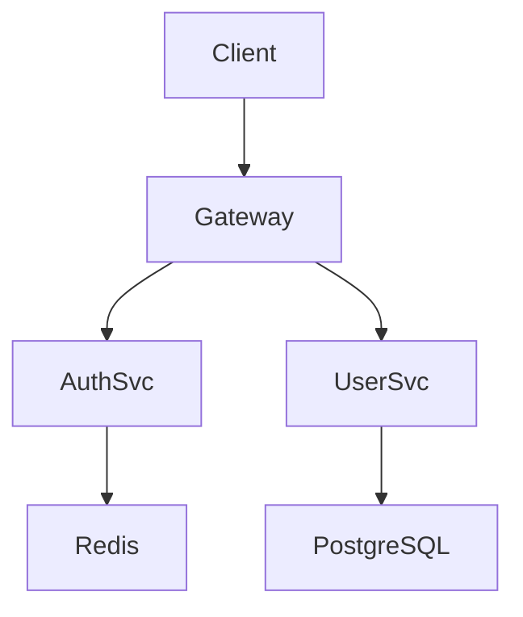

# Architect | 架构师

## When to Use

- After strategy-review before ui-design
- When starting a new system or major subsystem
- When existing architecture needs significant change
- When technical decisions need documentation (ADRs)
- When scaling or refactoring decisions are being made

## When NOT to Use

- UI/UX design decisions (use ui-design skill)
- Task-level planning (use task-planning skill)
- Implementation details (use tdd-development skill)
- When you just need a quick code snippet
- Minor feature additions with established patterns

---

## EXECUTION PROTOCOL

本 skill 的执行协议在 `PROTOCOL.json` 中定义，框架将验证每步执行。使用 `xiaoxiao continue` 启动交互式引导。

## ENTRY CHECK（必须首先执行）

1. 运行 `xiaoxiao save-progress architect phase1-start`
2. 才能开始 Phase 1

---

## Core Workflow

### Phase 1: Requirements Extraction

**Entry**: SPEC.md and strategy-review output exist
**Prerequisites Check**:
- If `./SPEC.md` does not exist → **BLOCKED**: "Cannot start architect. Run product-consult first to create SPEC.md."
**Actions**:
1. Read `./SPEC.md` - extract functional requirements
2. Read `docs/xiaoxiao/plans/strategy-review-output.md` - note constraints and decisions
3. Identify non-functional requirements:
   - **Performance**: latency, throughput, scalability
   - **Reliability**: uptime, recovery, redundancy
   - **Security**: authentication, authorization, data protection
   - **Observability**: logging, metrics, tracing
4. Ask: "What are the top 3 technical constraints we must respect?"
**Exit**: Requirements organized by category with constraints identified

---

### Phase 2: Architecture Pattern Selection

**Entry**: Requirements extracted
**Actions**:
1. Evaluate architectural patterns:
   - **Monolith**: Simple deployment, tight coupling
   - **Modular Monolith**: Clean boundaries, single deployment
   - **Microservices**: Independent scaling, distributed complexity
   - **Event-Driven**: Async, eventual consistency
   - **Layered**: Traditional web apps, clear separation
2. Ask: "Which pattern best fits our scale, team, and constraints?"
3. Document the choice with trade-off rationale
**Exit**: Selected pattern with justification

**Decision Matrix**:
```markdown
| Pattern | Best For | Avoid When |
|---------|----------|------------|
| Monolith | <10 devs, fast iteration | Multiple teams, scaling |
| Modular Monolith | Clean domain boundaries | Requires discipline |
| Microservices | Independent deploy, scaling | Complexity overhead |
| Event-Driven | Async workflows | Debugging difficulty |
```

---

### Phase 3: Subsystem Decomposition

**Entry**: Architecture pattern selected
**Actions**:
1. Identify bounded contexts / major domains
2. Define subsystems with single responsibility
3. Name each subsystem clearly (ubiquitous language)
4. Document subsystem responsibilities
5. Identify cross-cutting concerns (auth, logging, config)
**Exit**: System decomposed into named subsystems with responsibilities

**Template**:
```markdown
## Subsystems

### [Subsystem 1 Name]
- **Responsibility**: [What it owns and does]
- **Boundaries**: [What it does NOT do]
- **Key APIs**: [Main interfaces]

### [Subsystem 2 Name]
...
```

---

### Phase 4: Interface & Data Flow Design

**Entry**: Subsystems defined
**Actions**:
1. Define interfaces between subsystems
2. Specify:
   - **API contracts** (request/response shapes)
   - **Event schemas** (for async communication)
   - **Data ownership** (who is source of truth)
3. Design data flow: sync vs async paths
4. Document error handling and fallback paths
**Exit**: Clear interface definitions with examples

**Example Interface**:
```markdown
## Auth Service → User Service

### GetUserById
- **Request**: `GET /users/{id}`
- **Response**: `{ id, email, role, createdAt }`
- **Errors**: 404 if not found
- **Owner**: User Service (source of truth)
```

---

### Phase 5: Technology Decisions

**Entry**: Interfaces designed
**Actions**:
1. Make key technology choices per subsystem:
   - **Language/Framework**: Justify with requirements fit
   - **Database**: SQL vs NoSQL, specific technology
   - **Infrastructure**: Cloud, containers, serverless
2. Create ADR (Architecture Decision Record) for each significant choice
3. Ask: "What's our rollback plan if this technology fails?"
**Exit**: Technology stack defined with rationales

**ADR Template**:
```markdown
# ADR-001: [Decision Title]

## Status
Accepted

## Context
[Problem statement and constraints]

## Decision
[What we decided and why]

## Consequences
- **Positive**: [Benefits]
- **Negative**: [Trade-offs]
- **Neutral**: [Affected but not good/bad]

## Alternatives Considered
- **[Alternative 1]**: [Why rejected]
```

---

### Phase 6: Architecture Documentation

**Entry**: All technical decisions made
**Actions**:
1. Create architecture diagram (Mermaid preferred)
2. Document all ADRs
3. Create data flow diagram showing request paths
4. Document deployment architecture
5. Review with user for validation

**Run on completion**:
```bash
xiaoxiao complete architect docs/xiaoxiao/plans/architect-output.md
```
This updates `xiaoxiao-state.json` and records the skill output path.

**IMPORTANT**: Without running `xiaoxiao complete`, the skill is not marked as done and next skills will be blocked.

---

## Constraints

### MUST DO

- Start with requirements, not technology preferences
- Consider team size and expertise when choosing patterns
- Document trade-offs explicitly, not just decisions
- Identify cross-cutting concerns early
- Create ADRs for significant decisions
- Design for failure and recovery

### MUST NOT DO

- Choose microservices because they're "modern"
- Skip non-functional requirements
- Over-engineer for hypothetical future scale
- Ignore operational complexity
- Make technology decisions without understanding trade-offs
- Skip security considerations

---

## Reference Guide

| Topic | File | Load When |
|-------|------|-----------|
| Architecture Patterns | GUIDES/patterns.md | Choosing between Monolith/Microservices/etc |
| API Design Guidelines | GUIDES/api-design.md | Defining service interfaces |
| Data Modeling | GUIDES/data-modeling.md | Database selection and schema design |
| Security Architecture | GUIDES/security.md | Auth, authorization, data protection |
| ADR Template | OUTPUTS/adr-template.md | Documenting decisions |
| Mermaid Diagrams | OUTPUTS/diagram-examples.md | Architecture diagram reference |

---

## Output: Architecture Document

### Required Sections

1. **Overview** (system purpose and scope)
2. **Architecture Pattern** (chosen pattern with rationale)
3. **Subsystem Decomposition** (with responsibilities)
4. **Interface Design** (key APIs and data flows)
5. **Technology Stack** (per subsystem with justification)
6. **ADRs** (significant decisions)
7. **Architecture Diagram** (Mermaid)
8. **Cross-Cutting Concerns** (auth, logging, config)

### Example Output

```markdown
# Login System Architecture

## Overview
[System purpose and what it covers/not covers]

## Architecture Pattern
**Modular Monolith** - chosen for team size (5 devs) and iteration speed

## Subsystems
[See subsystem template above]

## Key Interfaces
[See interface examples above]

## Technology Stack
| Component | Choice | Rationale |
|-----------|--------|-----------|
| Auth | JWT + refresh tokens | Stateless, industry standard |
| User DB | PostgreSQL | ACID compliance, relational data |
| Cache | Redis | High read, low latency |

## ADRs
[ADR-001: PostgreSQL for user data]
[ADR-002: JWT for authentication]

## Architecture Diagram


## Cross-Cutting
- **Auth**: JWT with 15min access / 7d refresh
- **Logging**: Structured JSON to stdout
- **Config**: Environment variables, no hardcoding
```

---

## CONFIRM Nodes

| Phase | Confirmation Prompt |
|-------|---------------------|
| Phase 2 Complete | "Architecture pattern: **[X]**. Rationale: [